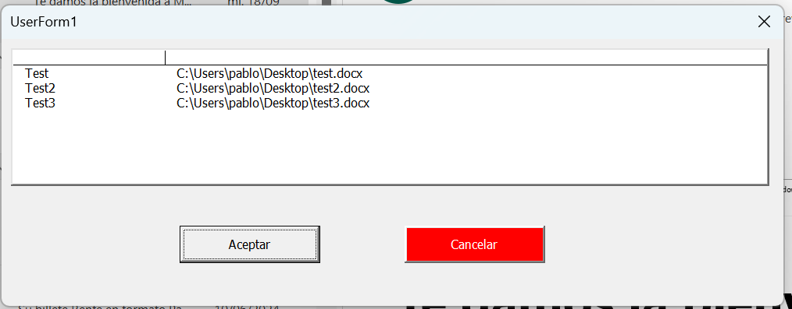

--------------------------------------------------------
Author: Pablo Abad Aparicio  (pablo.abad96@gmail.com)

Creation date: 19/09/2024

--------------------------------------------------------

# Referencias activadas
- Visual Basic For Applications
- Microsoft Outlook 16.0 Object Library
- OLE Automation
- Microsoft Office 16.0 Object Library
- Microsoft Excel 16.0 Object Library
- Microsoft Forms 2.0 Object Library
- Microsoft Word 16.0 Object Library
- Microsoft Scripting Runtime

# Descripción
> **IMPORTANTE** 
> 
> Antes de ejecutar la macro recurda definir las variables
> globales `gsEXCEL_PATH`, `gsEXCEL_SHEET_NAME` y `gsEXCEL_TABLE_NAME`
> que están al principio del módulo [`M01_MailsToWord.bas`](/M01_MailsToWord.bas).

Programa para cargar el texto selecionado de un mensaje
de Outlook activo en un Word. La ruta a los posibles ficheros
Word en los que cargar la información se obtiene de una tabla de Excel
especificada en las variables globales `gsEXCEL_PATH`, `gsEXCEL_SHEET_NAME` 
y `gsEXCEL_TABLE_NAME`  al principio del módulo 
[`M01_MailsToWord.bas`](/M01_MailsToWord.bas).

El Excel tiene que ser de una única hoja con un objeto tabla
que contenga dos columnas: Nombre identificativo, Path.
De esta forma al carga  nuevos registros en el objeto tabla
la macro los incorporará directamente.

Al principio de la macro se muestra el formulario `UserForm1`.
Contiene un `ListBox` ((Name): ListBox1, ColumnCount: 2) que muestra
la lista de rutas disponibles (las del fichero Excel) para que el
usuario seleccione el fichero donde quiera cargar la información.
Si el usuario clica en el `CommandButton` ((Name): btnCancel, Caption: 
Cancelar) o en la [x] en la esquina superior derecha de la ventana
el programa termina.
Si el usuario clica en el `CommandButton` ((Name): CommandButton1, Caption: 
Aceptar) sin haber selecionado ningún fichero aparecerá una ventana de error,
y si lo ha selecionado la macro continuará para cargar los elementos
del mail almacenados en el diccionario del modulo 
[`M02_MailDict.bas`](/M02_MailDict.bas) en el word de la ruta seleccionada.

# Estructura de módulos
- [`UserForm`](/UserForm1.frm) Formulario con ListBox y dos botones  
(Aceptar y Cancelar) para que el usuario pueda seleccionar el fichero de 
destino de una lista de opciones. VBA no permite importar un formulario,
pero replicando el de la imagen anterior y poniendo los atributos de cada 
elemento como indica el parrafo de encima de la imagen debería funcionar.
- [`M00_Documentación`](/M00_Documentacion.bas) Misma información que en 
README.md. Está repedita  ya que en el Editor de Visual Basic no existe 
README.md y las indicaciones pueden ser utilies para el mantenimiento de
la solución.
- [`M00_GenericFunction`](/M00_GenericFunctions.bas) Modulo de funciones 
de uso general, utilizables para varios proyecto.
- [`M01_MailsToWord.bas`](/M01_MailsToWord.bas) Subrutina de entrada al 
programa, el main de la macro.
- [`M02_MailDict.bas`](/M02_MailDict.bas) Crea un diccionario de los 
elementos del email que se copiarán en el word (From, To, Date, Subject y 
SelectedText).
- [`M03_AppendToWord.bas`](/M03_AppendToWord.bas) Añade los elementos
del diccionario del modulo anterior al final de un fichero word.
-[`M04_ExcelTableToArray.bas`](/M04_ExcelTableToArray.bas) Convierte
la tabla del Excel que contiene las rutas de los ficheros en un array
que se utilizara como fuente de la lista del formulario.

# Nomenclaturas
Todas las variables empiezan por una letra seguida de texto en CamelCase.
La primera letra indica el tipo de variable:
- `a` Array.
- `b` Boolean
- `d` Diccionario.
- `f` Función.
- `g[s|b]` Indica variable global tipo String o Boolean.
- `i` Entero.
- `ls` ListObject.
- `s` Subrutina o String.
- `o` Objetos.

# Instalación
1. [Habilitar pestaña **Programador** en Outlook](https://support.microsoft.com/es-es/office/mostrar-la-pesta%C3%B1a-programador-e1192344-5e56-4d45-931b-e5fd9bea2d45).
2. En la pestaña **Programador** clicar en **Visual Basic**.
3. Pestaña **Archivo**>**Importar Archivo** seleccionar todos los ficheros "M0..." para importarlos.
4. Crear manualmente el **UserForm**  con click derecho en el nombre del proyecto **Insertar**>**UserForm** y replicar el formulario de la imagen.
5. Clic derecho en el formulario creado opción **Ver código** y pegar el código [`UserForm`](/UserForm1.frm) Desde `Public Sub UserForm_Initialize()`.
6. Guardar el proyecto.
7. Abrir un email y clicar en la pestaña **Programador**>**Macros**>**Proyect1.sMailToWord**
8. Si todo ha ido bien la macro se ejecutara según está explicado en el apartado [Descripción](#descripción). En caso contrario aparecerá una ventana de 
diálogo para depurar el código y encontrar donde está el error.